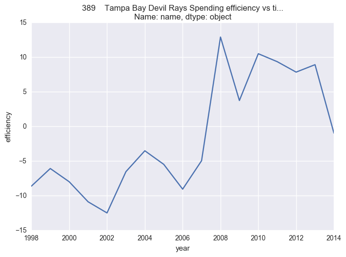

# Money Ball
## An analysis of Okaland's spending efficiency during the money ball period

This project aims to analyze the spending efficieny of oakland during the money ball period. During this period oakland was able to perform better than other team by redefining the important metrics of what makes a good player.

More information can be found at:
* [wikipedia](https://en.wikipedia.org/wiki/Moneyball)
* [Moneyball Movie](https://www.imdb.com/title/tt1210166/)
* [Moneyball book](https://www.amazon.com/Moneyball-The-Winning-Unfair-Game/dp/0393324818)
* [Web article: FivethiryEight](https://fivethirtyeight.com/features/dont-be-fooled-by-baseballs-small-budget-success-stories/)


```python
#import all the necessary files for this project
import sqlite3
import pandas as pd
import numpy as np
import matplotlib.pyplot as plt
import seaborn as sns

```


```python
# connect to the database 
sqlite_file = 'lahman2014.sqlite'
conn = sqlite3.connect(sqlite_file)
```

## Part1: Wrangling

Query the database to obtain team data and store it in a variable


```python
teams_query = "SELECT yearID, lgID, teamID, franchID, G, W, name FROM Teams"
teams_info = pd.read_sql(teams_query, conn)
teams_info.head()

```


<div>
<table border="1" class="dataframe">
  <thead>
    <tr style="text-align: right;">
      <th></th>
      <th>yearID</th>
      <th>lgID</th>
      <th>teamID</th>
      <th>franchID</th>
      <th>G</th>
      <th>W</th>
      <th>name</th>
    </tr>
  </thead>
  <tbody>
    <tr>
      <th>0</th>
      <td>1871</td>
      <td>NA</td>
      <td>BS1</td>
      <td>BNA</td>
      <td>31</td>
      <td>20</td>
      <td>Boston Red Stockings</td>
    </tr>
    <tr>
      <th>1</th>
      <td>1871</td>
      <td>NA</td>
      <td>CH1</td>
      <td>CNA</td>
      <td>28</td>
      <td>19</td>
      <td>Chicago White Stockings</td>
    </tr>
    <tr>
      <th>2</th>
      <td>1871</td>
      <td>NA</td>
      <td>CL1</td>
      <td>CFC</td>
      <td>29</td>
      <td>10</td>
      <td>Cleveland Forest Citys</td>
    </tr>
    <tr>
      <th>3</th>
      <td>1871</td>
      <td>NA</td>
      <td>FW1</td>
      <td>KEK</td>
      <td>19</td>
      <td>7</td>
      <td>Fort Wayne Kekiongas</td>
    </tr>
    <tr>
      <th>4</th>
      <td>1871</td>
      <td>NA</td>
      <td>NY2</td>
      <td>NNA</td>
      <td>33</td>
      <td>16</td>
      <td>New York Mutuals</td>
    </tr>
  </tbody>
</table>
</div>


Query the table to obtain the total salaries for each team in each year


```python
salary_query2 = "SELECT yearID, lgID, teamID, sum(salary) FROM Salaries GROUP BY yearID, teamID "   
salary_tbl = pd.read_sql(salary_query2, conn)
salary_tbl.sort_values(by='teamID', axis = 0)
salary_tbl.head()
```


<div>
<table border="1" class="dataframe">
  <thead>
    <tr style="text-align: right;">
      <th></th>
      <th>yearID</th>
      <th>lgID</th>
      <th>teamID</th>
      <th>sum(salary)</th>
    </tr>
  </thead>
  <tbody>
    <tr>
      <th>0</th>
      <td>1985</td>
      <td>NL</td>
      <td>ATL</td>
      <td>14807000.0</td>
    </tr>
    <tr>
      <th>1</th>
      <td>1985</td>
      <td>AL</td>
      <td>BAL</td>
      <td>11560712.0</td>
    </tr>
    <tr>
      <th>2</th>
      <td>1985</td>
      <td>AL</td>
      <td>BOS</td>
      <td>10897560.0</td>
    </tr>
    <tr>
      <th>3</th>
      <td>1985</td>
      <td>AL</td>
      <td>CAL</td>
      <td>14427894.0</td>
    </tr>
    <tr>
      <th>4</th>
      <td>1985</td>
      <td>AL</td>
      <td>CHA</td>
      <td>9846178.0</td>
    </tr>
  </tbody>
</table>
</div>


Use **yearID, lgID** and **teamID** to **inner join** the salaries table and the teams table to: 
1. obtain the salaries, wins and games played for each team in each year.
2. Ensure that only team that appear in both tables are extracted from the join to prevent the creation of missing values which may happen when we use left/right/outer join. Therefore inner join is the preferred join.
        Note: Teams table has team information starting from the 1871 while Salaries table has team salaries information starting from 1985. Thus an right/outer join will produce too many null fields in the salary column.  Though we have lost team information from the team table from 1871 to 1985, the lost team information wouldn't have been useful to us anyway because there is no corresponding data from 1871 to 1985 in the salaries table.


```python
#inner join the two tables queried from the database
league = teams_info.merge(salary_tbl, how = 'inner', on = ['teamID', 'yearID', 'lgID'])
league.sort_values(by = ['name', 'yearID'])

# drop any rows that contain missing values
league.dropna()
league.head()
```


<div>
<table border="1" class="dataframe">
  <thead>
    <tr style="text-align: right;">
      <th></th>
      <th>yearID</th>
      <th>lgID</th>
      <th>teamID</th>
      <th>franchID</th>
      <th>G</th>
      <th>W</th>
      <th>name</th>
      <th>sum(salary)</th>
    </tr>
  </thead>
  <tbody>
    <tr>
      <th>0</th>
      <td>1985</td>
      <td>AL</td>
      <td>BAL</td>
      <td>BAL</td>
      <td>161</td>
      <td>83</td>
      <td>Baltimore Orioles</td>
      <td>11560712.0</td>
    </tr>
    <tr>
      <th>1</th>
      <td>1985</td>
      <td>AL</td>
      <td>BOS</td>
      <td>BOS</td>
      <td>163</td>
      <td>81</td>
      <td>Boston Red Sox</td>
      <td>10897560.0</td>
    </tr>
    <tr>
      <th>2</th>
      <td>1985</td>
      <td>AL</td>
      <td>CAL</td>
      <td>ANA</td>
      <td>162</td>
      <td>90</td>
      <td>California Angels</td>
      <td>14427894.0</td>
    </tr>
    <tr>
      <th>3</th>
      <td>1985</td>
      <td>AL</td>
      <td>CHA</td>
      <td>CHW</td>
      <td>163</td>
      <td>85</td>
      <td>Chicago White Sox</td>
      <td>9846178.0</td>
    </tr>
    <tr>
      <th>4</th>
      <td>1985</td>
      <td>AL</td>
      <td>CLE</td>
      <td>CLE</td>
      <td>162</td>
      <td>60</td>
      <td>Cleveland Indians</td>
      <td>6551666.0</td>
    </tr>
  </tbody>
</table>
</div>


**Missing data** has been dealt with by **dropping rows with missing data.**
This **hasn't affected our dataframe** in any way because the number of rows before and after the drop has remained the same


```python
def win_rate(row):
    return (row['W']/row['G']) * 100
    
league['win_rate'] = league.apply(lambda row: win_rate(row), axis = 1)
league = league[league['yearID'] >= 1990 ]
league.head()
```


<div>
<table border="1" class="dataframe">
  <thead>
    <tr style="text-align: right;">
      <th></th>
      <th>yearID</th>
      <th>lgID</th>
      <th>teamID</th>
      <th>franchID</th>
      <th>G</th>
      <th>W</th>
      <th>name</th>
      <th>sum(salary)</th>
      <th>win_rate</th>
    </tr>
  </thead>
  <tbody>
    <tr>
      <th>130</th>
      <td>1990</td>
      <td>AL</td>
      <td>BAL</td>
      <td>BAL</td>
      <td>161</td>
      <td>76</td>
      <td>Baltimore Orioles</td>
      <td>9680084.0</td>
      <td>47.204969</td>
    </tr>
    <tr>
      <th>131</th>
      <td>1990</td>
      <td>AL</td>
      <td>BOS</td>
      <td>BOS</td>
      <td>162</td>
      <td>88</td>
      <td>Boston Red Sox</td>
      <td>20558333.0</td>
      <td>54.320988</td>
    </tr>
    <tr>
      <th>132</th>
      <td>1990</td>
      <td>AL</td>
      <td>CAL</td>
      <td>ANA</td>
      <td>162</td>
      <td>80</td>
      <td>California Angels</td>
      <td>21720000.0</td>
      <td>49.382716</td>
    </tr>
    <tr>
      <th>133</th>
      <td>1990</td>
      <td>AL</td>
      <td>CHA</td>
      <td>CHW</td>
      <td>162</td>
      <td>94</td>
      <td>Chicago White Sox</td>
      <td>9491500.0</td>
      <td>58.024691</td>
    </tr>
    <tr>
      <th>134</th>
      <td>1990</td>
      <td>AL</td>
      <td>CLE</td>
      <td>CLE</td>
      <td>162</td>
      <td>77</td>
      <td>Cleveland Indians</td>
      <td>14487000.0</td>
      <td>47.530864</td>
    </tr>
  </tbody>
</table>
</div>


```python
# Change yearID column and W column to type int
league.loc[:,('yearID')].astype(int)
league.loc[: , ('W')].astype(int)

# Create a variable teamID that is an array of all IDs. 
# variable will be useful later on
teams = league['teamID']
teamID = []
for team in teams:
    if not (team in teamID):
        teamID.append(team)

```

## Part 2: Exploratory data analysis

### Payroll distrubution

#### Problem 2

Plots that show payroll distribution accross time for each team


```python
# for each team plot the payroll vs time
for id in teamID:
    t = league.loc[league['teamID'] == id]
    plt.plot(t['yearID'], t['sum(salary)'])
    plt.xlabel('year')
    plt.ylabel('payroll')
    plt.title(t['name'][1:2] + ' Payroll vs Time')
    plt.show()
```


payroll seem to generally increase over time for most teams


```python
#plot below shows a scatter plot of payroll vs time for all teams
plt.scatter(league['yearID'],league['sum(salary)'])
plt.ylabel('salary')
plt.xlabel('time')
plt.title('line Graph of Salary vs Time for all teams')
plt.show()
```


#### Question 2
Statements about payroll distribution accross time:
1. Mean payroll has increased over time for most teams
2. Standard deviation of the payrolls accross teams has increased over time


####  Problem 3

1. Plot that shows mean payroll has increased over time


```python
plt.plot(league.groupby('yearID')['sum(salary)'].mean())
plt.xlabel('Time(years)')
plt.ylabel('mean payroll')
plt.title('Line Graph of mean payroll vs Time (years) for all teams')
plt.show()
```


Plot above has a positive slope showing that mean payroll has continously increased over time

2. Plot shows standard deviation of payrolls has increased over time


```python
year = 1990
y = []

# loop through all the 25 years and get the salaries for all teams in each year
# store the salaries in list y
for x in range(0,25):
    t = league.loc[league['yearID'] == (year + x)]['sum(salary)']
    y.append(t)

# plot the 
plt.boxplot(y)
plt.xlabel('time in years')
plt.ylabel('Payroll')
plt.title('Box plots showing Payroll vs time in years')
plt.show()
   
```


The boxplots have generally increased in height over time showing that the standard deviation of salaries 
has generally increased over time.

### Correlation between payroll and winning percentage


```python

x = league['sum(salary)']
y = league['win_rate']
plt.scatter( x,y )
plt.xlabel('Payroll')
plt.ylabel('win percentage')
plt.title('Scatter plot for Payroll vs win rate for all teams')

# regression line
fit  = np.polyfit( x, y, 1 )
plt.plot(x, fit[0] * x + fit[1], color = 'red')
plt.show()

```


According to the regression line, as payroll increases win percentage increases

#### Problem 4


```python
# Create column category that indicates time period for each row
league.loc[: , 'category'] = pd.cut(league['yearID'],5, precision = 0, labels = ['1', '2', '3', '4', '5'])
league.loc[: , 'category'].astype(int)
league.head()

```


<div>
<table border="1" class="dataframe">
  <thead>
    <tr style="text-align: right;">
      <th></th>
      <th>yearID</th>
      <th>lgID</th>
      <th>teamID</th>
      <th>franchID</th>
      <th>G</th>
      <th>W</th>
      <th>name</th>
      <th>sum(salary)</th>
      <th>win_rate</th>
      <th>category</th>
    </tr>
  </thead>
  <tbody>
    <tr>
      <th>130</th>
      <td>1990</td>
      <td>AL</td>
      <td>BAL</td>
      <td>BAL</td>
      <td>161</td>
      <td>76</td>
      <td>Baltimore Orioles</td>
      <td>9680084.0</td>
      <td>47.204969</td>
      <td>1</td>
    </tr>
    <tr>
      <th>131</th>
      <td>1990</td>
      <td>AL</td>
      <td>BOS</td>
      <td>BOS</td>
      <td>162</td>
      <td>88</td>
      <td>Boston Red Sox</td>
      <td>20558333.0</td>
      <td>54.320988</td>
      <td>1</td>
    </tr>
    <tr>
      <th>132</th>
      <td>1990</td>
      <td>AL</td>
      <td>CAL</td>
      <td>ANA</td>
      <td>162</td>
      <td>80</td>
      <td>California Angels</td>
      <td>21720000.0</td>
      <td>49.382716</td>
      <td>1</td>
    </tr>
    <tr>
      <th>133</th>
      <td>1990</td>
      <td>AL</td>
      <td>CHA</td>
      <td>CHW</td>
      <td>162</td>
      <td>94</td>
      <td>Chicago White Sox</td>
      <td>9491500.0</td>
      <td>58.024691</td>
      <td>1</td>
    </tr>
    <tr>
      <th>134</th>
      <td>1990</td>
      <td>AL</td>
      <td>CLE</td>
      <td>CLE</td>
      <td>162</td>
      <td>77</td>
      <td>Cleveland Indians</td>
      <td>14487000.0</td>
      <td>47.530864</td>
      <td>1</td>
    </tr>
  </tbody>
</table>
</div>


Below is a scatter plot for Mean win percentage vs Mean win payroll for all team


```python
x = league.groupby(['teamID', 'category'])['sum(salary)'].mean()
y = league.groupby(['teamID', 'category'])['win_rate'].mean()

plt.scatter( x , y)
plt.xlabel('mean payroll')
plt.ylabel('mean win percentage')
plt.title('Mean Win percentage vs mean payroll for all teams')

#regression line
fit  = np.polyfit( x, y, 1 )
plt.plot(x, fit[0] * x + fit[1], color = 'red')
plt.show()


```


Below are graphs for win rate vs payroll for each team


```python
mean_payroll = league.groupby(['teamID', 'category'])['sum(salary)'].mean()
mean_winrate = league.groupby(['teamID', 'category'])['win_rate'].mean()

# lists below contain the co-efficicents and constants of the regression lines for each team 
co_eff = []
const = []
t_ids = []
for id in league['teamID']:
    
    t = league.loc[league['teamID'] == id]
    x = mean_payroll[id]
    y = mean_winrate[id]
    
    plt.scatter(x , y )    
    plt.xlabel('mean payroll')
    plt.ylabel('mean win percentage')
    plt.title(t["name"][1:2] + "mean win percentage vs mean payroll")
    
    # regression line
    fit  = np.polyfit( x, y, 1 )
    plt.plot(x, fit[0] * x + fit[1], color = 'red')
    
    if not(id in t_ids):
        t_ids.append(id)
        co_eff.append(fit[0])
        const.append(fit[1])
        
    plt.show()
    

```


    C:\Users\Owner\Anaconda3\lib\site-packages\numpy\lib\polynomial.py:595: RankWarning: Polyfit may be poorly conditioned
      warnings.warn(msg, RankWarning)


    C:\Users\Owner\Anaconda3\lib\site-packages\numpy\lib\polynomial.py:595: RankWarning: Polyfit may be poorly conditioned
      warnings.warn(msg, RankWarning)


    C:\Users\Owner\Anaconda3\lib\site-packages\numpy\lib\polynomial.py:595: RankWarning: Polyfit may be poorly conditioned
      warnings.warn(msg, RankWarning)


#### Question 2
 
 Inorder to find teams that are most efficient at paying for wins:
1. Create a dataframe that contains the functions for each team
2. Sort the dataframe according to the co-efficients of the regression line
3. The higher the co-efficient is, the better the team is at paying for wins


```python
d = {'teamID': t_ids, 'co-efficients': co_eff, 'constants': const}
funs = pd.DataFrame(data = d)

#the data will be sorted in descending order starting from the most efficient team at paying for wins
funs.sort_values(by = 'co-efficients', ascending = False, inplace = True )
funs.head(12)

```


<div>
<table border="1" class="dataframe">
  <thead>
    <tr style="text-align: right;">
      <th></th>
      <th>co-efficients</th>
      <th>constants</th>
      <th>teamID</th>
    </tr>
  </thead>
  <tbody>
    <tr>
      <th>2</th>
      <td>2.210655e-06</td>
      <td>-17.641063</td>
      <td>CAL</td>
    </tr>
    <tr>
      <th>29</th>
      <td>5.275893e-07</td>
      <td>22.510284</td>
      <td>TBA</td>
    </tr>
    <tr>
      <th>34</th>
      <td>3.317414e-07</td>
      <td>21.399177</td>
      <td>MIA</td>
    </tr>
    <tr>
      <th>33</th>
      <td>2.824453e-07</td>
      <td>27.502610</td>
      <td>WAS</td>
    </tr>
    <tr>
      <th>8</th>
      <td>2.456416e-07</td>
      <td>42.482717</td>
      <td>ML4</td>
    </tr>
    <tr>
      <th>31</th>
      <td>1.636089e-07</td>
      <td>37.517806</td>
      <td>MIL</td>
    </tr>
    <tr>
      <th>28</th>
      <td>1.293287e-07</td>
      <td>43.667352</td>
      <td>ANA</td>
    </tr>
    <tr>
      <th>27</th>
      <td>1.132821e-07</td>
      <td>42.740639</td>
      <td>FLO</td>
    </tr>
    <tr>
      <th>5</th>
      <td>1.101527e-07</td>
      <td>39.569099</td>
      <td>DET</td>
    </tr>
    <tr>
      <th>25</th>
      <td>1.025154e-07</td>
      <td>46.119689</td>
      <td>SLN</td>
    </tr>
    <tr>
      <th>10</th>
      <td>7.418883e-08</td>
      <td>49.160040</td>
      <td>OAK</td>
    </tr>
    <tr>
      <th>4</th>
      <td>5.969963e-08</td>
      <td>47.830827</td>
      <td>CLE</td>
    </tr>
  </tbody>
</table>
</div>


According to the sorted dataframe **Oakland** is roughly the 11th best team at spending efficiency


```python
# From the funs dataframe get the best and worst teams at paying for wins
# by taking the top 5 teams and bottom 5 teams in the sorted dataframe
best_teams_name = []
worst_teams_name = []

#most efficient teams are at the top of funs dataframe
best_teams_id = funs['teamID'][:5]

#least efficient teams are at the bottom of funs dataframe
worst_teams_id = funs['teamID'][-5:]

# Get the names of the teams from their ids
for t in best_teams_id:
    best_teams_name.append( league.loc[league['teamID'] == t]['name'][1:2] )

for t in worst_teams_id:
    worst_teams_name.append( league.loc[league['teamID'] == t]['name'][1:2] )
    
print (" Best teams at paying for wins are: ")
print( best_teams_name)
print("\n")
print (" Worst teams at paying for wins are:")
print (worst_teams_name)

```

     Best teams at paying for wins are: 
    [158    California Angels
    Name: name, dtype: object, 389    Tampa Bay Devil Rays
    Name: name, dtype: object, 819    Miami Marlins
    Name: name, dtype: object, 617    Washington Nationals
    Name: name, dtype: object, 164    Milwaukee Brewers
    Name: name, dtype: object]
    
    
     Worst teams at paying for wins are:
    [170    Atlanta Braves
    Name: name, dtype: object, 169    Toronto Blue Jays
    Name: name, dtype: object, 178    Pittsburgh Pirates
    Name: name, dtype: object, 175    Montreal Expos
    Name: name, dtype: object, 594    Los Angeles Angels of Anaheim
    Name: name, dtype: object]


## Part 3: Data Transformations

### Standardizing accross years
#### Problem 5


```python
#get the salary standard deviation and mean salary for each row
salary_std = league.groupby('yearID')['sum(salary)'].std()
salary_mean = league.groupby('yearID')['sum(salary)'].mean()
```


```python
def standardize_pay(row):
    return (  (row['sum(salary)'] - salary_mean[row['yearID']])/salary_std[row['yearID']]  )

#create a new column that shows the standardized payroll accross a five year time period
league['std_payroll'] = league.apply(lambda row: standardize_pay(row), axis = 1)

league.head()
```


<div>
<table border="1" class="dataframe">
  <thead>
    <tr style="text-align: right;">
      <th></th>
      <th>yearID</th>
      <th>lgID</th>
      <th>teamID</th>
      <th>franchID</th>
      <th>G</th>
      <th>W</th>
      <th>name</th>
      <th>sum(salary)</th>
      <th>win_rate</th>
      <th>category</th>
      <th>std_payroll</th>
    </tr>
  </thead>
  <tbody>
    <tr>
      <th>130</th>
      <td>1990</td>
      <td>AL</td>
      <td>BAL</td>
      <td>BAL</td>
      <td>161</td>
      <td>76</td>
      <td>Baltimore Orioles</td>
      <td>9680084.0</td>
      <td>47.204969</td>
      <td>1</td>
      <td>-1.959861</td>
    </tr>
    <tr>
      <th>131</th>
      <td>1990</td>
      <td>AL</td>
      <td>BOS</td>
      <td>BOS</td>
      <td>162</td>
      <td>88</td>
      <td>Boston Red Sox</td>
      <td>20558333.0</td>
      <td>54.320988</td>
      <td>1</td>
      <td>0.924213</td>
    </tr>
    <tr>
      <th>132</th>
      <td>1990</td>
      <td>AL</td>
      <td>CAL</td>
      <td>ANA</td>
      <td>162</td>
      <td>80</td>
      <td>California Angels</td>
      <td>21720000.0</td>
      <td>49.382716</td>
      <td>1</td>
      <td>1.232198</td>
    </tr>
    <tr>
      <th>133</th>
      <td>1990</td>
      <td>AL</td>
      <td>CHA</td>
      <td>CHW</td>
      <td>162</td>
      <td>94</td>
      <td>Chicago White Sox</td>
      <td>9491500.0</td>
      <td>58.024691</td>
      <td>1</td>
      <td>-2.009859</td>
    </tr>
    <tr>
      <th>134</th>
      <td>1990</td>
      <td>AL</td>
      <td>CLE</td>
      <td>CLE</td>
      <td>162</td>
      <td>77</td>
      <td>Cleveland Indians</td>
      <td>14487000.0</td>
      <td>47.530864</td>
      <td>1</td>
      <td>-0.685437</td>
    </tr>
  </tbody>
</table>
</div>


#### Problem 6

Graphs showing mean winnning percentage vs mean standardized payroll for each team


```python
mean_std_payroll = league.groupby(['teamID', 'category'])['std_payroll'].mean()
mean_winrate = league.groupby(['teamID', 'category'])['win_rate'].mean()

for id in league['teamID']:
    t = league.loc[league['teamID'] == id]
    
    x = mean_std_payroll[id]
    y = mean_winrate[id]
    plt.scatter( x, y )    
    plt.xlabel('mean standard payroll')
    plt.ylabel('mean win_rate')
    plt.title(t["name"][1:2] + " mean win_rate vs mean standard payroll")
    
     # regression line 
    fit = np.polyfit(x,y,1)
    plt.plot(x, fit[0]*x + fit[1], color = 'red')
    
    plt.show()
```


    C:\Users\Owner\Anaconda3\lib\site-packages\numpy\lib\polynomial.py:595: RankWarning: Polyfit may be poorly conditioned
      warnings.warn(msg, RankWarning)


    C:\Users\Owner\Anaconda3\lib\site-packages\numpy\lib\polynomial.py:595: RankWarning: Polyfit may be poorly conditioned
      warnings.warn(msg, RankWarning)


    C:\Users\Owner\Anaconda3\lib\site-packages\numpy\lib\polynomial.py:595: RankWarning: Polyfit may be poorly conditioned
      warnings.warn(msg, RankWarning)


#### Question 3 
Plot from problem 4 only shows mean winning percentage vs mean payroll for teams but doesn't show how a team's payroll compares to other teams.

Plot from problem 6 not only shows mean winning percentage vs mean payroll for teams **but also shows whether the team has a greater or smaller payroll than other teams. **

 note: Plots from problem 6 may enable us to infer whether  a team may need to have a payroll greater than all other teams inorder to be more effective at paying for wins

### Expected Wins

#### Problem 7

Code below produces a scatter plot showing win percentage vs standardized payroll for all teams in one plot


```python
x = league["std_payroll"]
y = league["win_rate"]

plt.scatter(x, y )
plt.xlabel("standardized payroll")
plt.ylabel("win percentage")
plt.title("Winning percentage vs standardized payroll")

 # regression line 
fit = np.polyfit(x,y,1)
plt.plot(x, fit[0]*x + fit[1], color = 'red')


plt.show()
```


### Spending efficiency

#### Problem 8


```python
league["efficiency"] = league["win_rate"] - (50 + (2.5 * league["std_payroll"] ))
league.head()
```


<div>
<table border="1" class="dataframe">
  <thead>
    <tr style="text-align: right;">
      <th></th>
      <th>yearID</th>
      <th>lgID</th>
      <th>teamID</th>
      <th>franchID</th>
      <th>G</th>
      <th>W</th>
      <th>name</th>
      <th>sum(salary)</th>
      <th>win_rate</th>
      <th>category</th>
      <th>std_payroll</th>
      <th>efficiency</th>
    </tr>
  </thead>
  <tbody>
    <tr>
      <th>130</th>
      <td>1990</td>
      <td>AL</td>
      <td>BAL</td>
      <td>BAL</td>
      <td>161</td>
      <td>76</td>
      <td>Baltimore Orioles</td>
      <td>9680084.0</td>
      <td>47.204969</td>
      <td>1</td>
      <td>-1.959861</td>
      <td>2.104621</td>
    </tr>
    <tr>
      <th>131</th>
      <td>1990</td>
      <td>AL</td>
      <td>BOS</td>
      <td>BOS</td>
      <td>162</td>
      <td>88</td>
      <td>Boston Red Sox</td>
      <td>20558333.0</td>
      <td>54.320988</td>
      <td>1</td>
      <td>0.924213</td>
      <td>2.010454</td>
    </tr>
    <tr>
      <th>132</th>
      <td>1990</td>
      <td>AL</td>
      <td>CAL</td>
      <td>ANA</td>
      <td>162</td>
      <td>80</td>
      <td>California Angels</td>
      <td>21720000.0</td>
      <td>49.382716</td>
      <td>1</td>
      <td>1.232198</td>
      <td>-3.697779</td>
    </tr>
    <tr>
      <th>133</th>
      <td>1990</td>
      <td>AL</td>
      <td>CHA</td>
      <td>CHW</td>
      <td>162</td>
      <td>94</td>
      <td>Chicago White Sox</td>
      <td>9491500.0</td>
      <td>58.024691</td>
      <td>1</td>
      <td>-2.009859</td>
      <td>13.049338</td>
    </tr>
    <tr>
      <th>134</th>
      <td>1990</td>
      <td>AL</td>
      <td>CLE</td>
      <td>CLE</td>
      <td>162</td>
      <td>77</td>
      <td>Cleveland Indians</td>
      <td>14487000.0</td>
      <td>47.530864</td>
      <td>1</td>
      <td>-0.685437</td>
      <td>-0.755544</td>
    </tr>
  </tbody>
</table>
</div>


```python
# array for teams whose graph will be plotted
team_ids = ["OAK","BOS", "NYA", "ATL", "TBA"]

for id in team_ids:
    t = league.loc[league["teamID"] == id]
    plt.plot(t["yearID"], t["efficiency"]) 
    plt.xlabel("year")
    plt.ylabel("efficiency")
    plt.title(t["name"][1:2] + " Spending efficiency vs time(years)")
    plt.show()
```





#### Question 4
What can we learn from the plots above compared to plots in question 2 and question 3?
1. This plot shows how good teams are paying for wins compared to other teams accross time. 
2. Question 2 only shows how good team are at paying for wins but doesn't show how good they are accross time and compared to other teams
3. Question 2 shows how good teams are at paying for wins compared to other teams but doesn't show how good they are accross time.

note: in summary this plot shows each team's spending efficiency compared to other teams accross time while question 2 only shows a team's spending efficiency and question 3 only shows team's spending efficiency compared to other teams.


**Oakland was  most efficient at paying for wins during the money ball period (2000 - 2005)** because oakland records the highest spending efficiency during this time period
